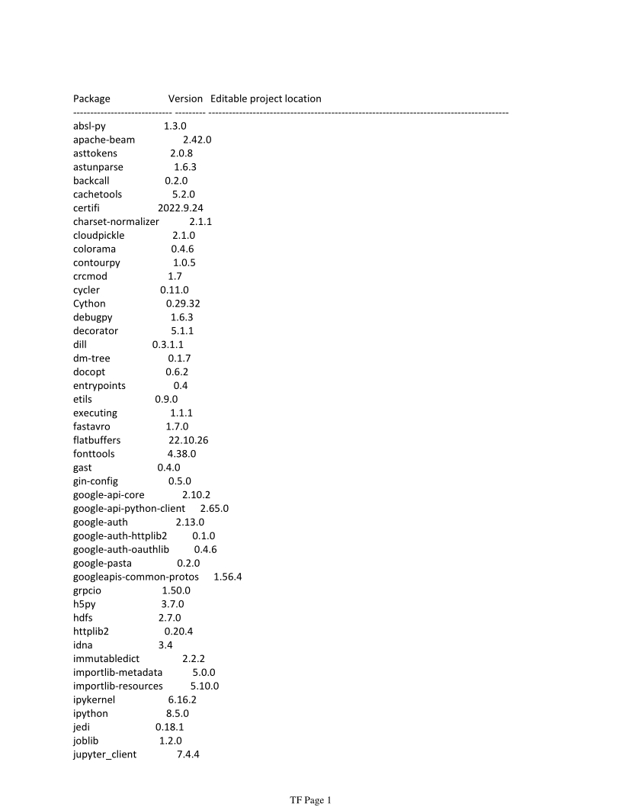
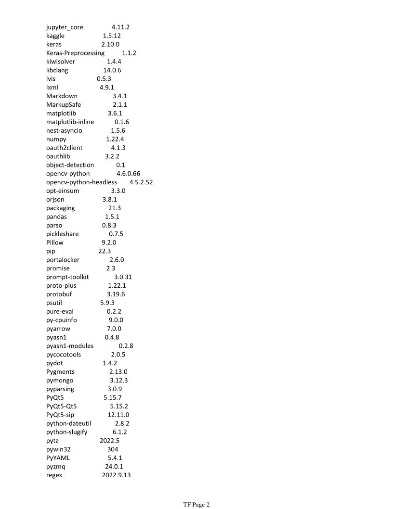
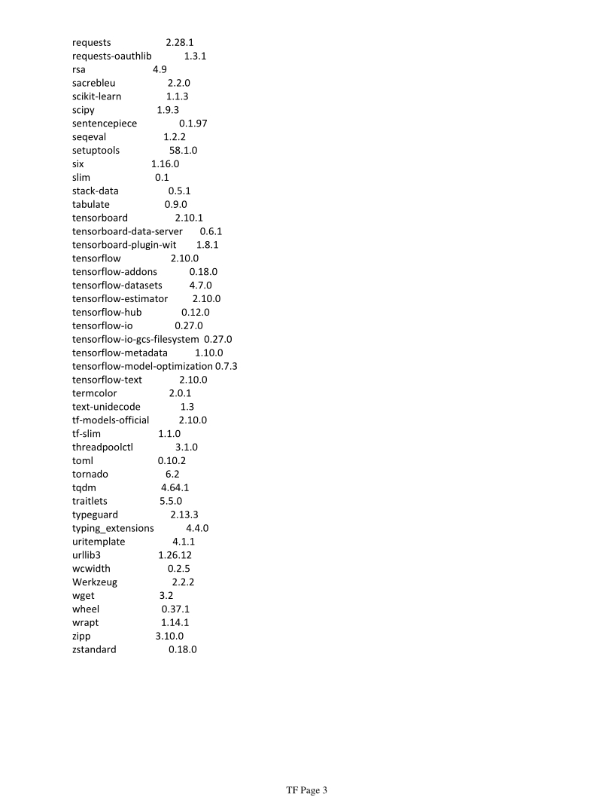
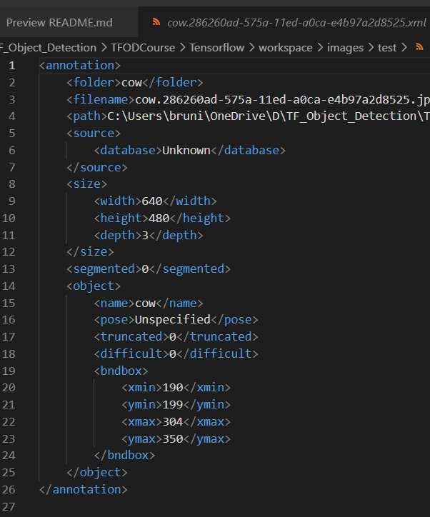

# Tensorflow Object Detection 
# Pet detection

Thanks to   

[Nisarg Kapkar](https://medium.com/swlh/tensorflow-2-object-detection-api-with-google-colab-b2af171e81cc)  
[Ygor Serpa](https://towardsdatascience.com/how-to-install-tensorflow-2-object-detection-api-on-windows-2eef9b7ae869)  
[Nicholas Renotte]()

This 2 Notebooks provides a complete set of code to be able to train and leverage own custom object detection model using the Tensorflow Object Detection API. 

In this instance the machine was asked to detect 4 pet that i have in the room

- 🦄 a fat unicorn 
- 🐷 a piggy bank 
- 🐰 a bunny crumb cleaner 
- 🐮 a cow 

I will end up on doing this
* set up all the software stuff necessary 
* install all the tensorflow objet detection dependencies
* set up the virtual environment which is called tf
* import all the dependencies
* define the images we need
* set up the folders
* capture the images and lebel them
* the do all the installment necessary
* train the model
* detect from an image (see below)
* detect from the webcam in real time detection
* froze the graph

---

---

# Steps to software set up & environment

I work in a Win10 machine, so I followed the instruction in [Tensorflow pages](https://www.tensorflow.org/install/pip#windows-wsl2_1) to set up it.

Installed *Windows Native Requires Microsoft Visual C++ Redistributable for Visual Studio 2015, 2017 and 2019*.  

I don't have a Nvidia GPU (i have Intel) so didn't install the booster avalable for GPU.
I sow that with GPU every 100 epoch (iteration) on model trainig takes like 40 to 50 sec. Without the GPU acceleration (me 😆 ) processing time was 8 to 10 minute!!! 
But did the work, slow, but worked.

Create the venv
* installed **miniconda** (or what you want)
* python version == 3.9.12 (must be Python 3.7–3.10)
* `conda create --name tf python=3.9`
* activate venev `.\tf\Scripts\activate` (to acivate venv in win )
* install jupyter dependencies 
>  `pip install ipykernel`  
>  `python -m ipykernel install --user --name=tf`
* install tensorflow (version 2.10 in my case) 
> `pip install tensorflow`

These the packages at the end of the installation 
> `pip list`  

---
# Time to catch the images
Grabbing the images can be done as wanted.
The only real fact to be aware is images size: they have to be of **middle size**. So if collected from the web set the size to medium from google images. Is better to have this images size to avoid crazy time consuming in the trainig process. Everything work well the same.

Images to train the machine can be
*   Downloaded from google or pixbay
*   Taken (like i did) from the notebook camera. I used this python script [`Image Processing.ipynb`](ImageProcessing.ipynb)

* For **prototyping** the model, 5 to 10 images are fine. I saw that is enought to take 5 to 10 picture from few angolation of the object and see if the trainig process is fine. Light is very important! No  dark images. If then something go wrong, the  time spent to trainig will not be so huge and it is possibble to train again the model whit not to much pain.  

---
Framed image (an example)  

xml (an example)  

---

* Then these image  must converted in something digestable from Tensorflow, i mean they have to be converted in `TFRecords`. This tool [labelImage](https://github.com/heartexlabs/labelImg) allow us to frame the objects.  
It  creates .xml files that contains the necessary *annotation* to convert the images in the TFRecord.
In my case i have 4 type of images (classes), so for each type i had to define a tag (*uni* ,*pig* , *cow* , *bun*  the system is case sensitive); then I labeled each images selecting as precisely I could the objects to detect.

---

---

# Last and happy to do it : TRAINING THE MODEL

* The collected images and xml files must be divided (cut and paste) into two folders **train** and **test**. The ratio should be 80% in train , 20% in test. This can be done manually (in case of few images like here) or shuffling the images with a python script.  So now all folders and annotations should be split between the following two folders.  
`\TFODCourse\Tensorflow\workspace\images\train`  
`\TFODCourse\Tensorflow\workspace\images\test`

* Now it is possible to begin the training process...
This notebook  `Training and Detection.ipynb`,  walk you through installing Tensorflow Object Detection, making detections, saving and exporting the model.
Just for prototyping **epoch time** is to 2000 (simple said the iteration of regression process) and everyry 100 epoch Tensorflow displays the loss metrics.

* From the [Tensorflow zoo](https://github.com/tensorflow/models/blob/master/research/object_detection/g3doc/tf2_detection_zoo.md) (pretrained algo) i choose this one `'SSD MobileNet V2 FPNLite 320x320'` that was fast but not to precise, this because i have to take in account the DELL machine on which i was trainig the model, no too much processing power for these things.  
During the trainig process this is the output of the procedure.
---

---

Onece trained, ideally we mus take a look at how well its performing.  
The kpi performance are these:  
* **Precision**: TP/(TP+FP)  
  What proportion of my detections where correct?
* **Recall**: TP/(TP+FN)
  What proportion of actual object did I capture?
* **Loss**: A metod to evaluate how well the model is performing against the data provided  
---

## Performace metrics

It is amazing how - with only few images for each object - the algo did well.  

Here is the **AP** (average precision) around 89%.

To be honest , when i was in front of the camera the machine recognized me as cow... and this was not too funny ...  
no it is 😆.   
In any case, I was wearing a white shirt and when pulling it up sometime I was targeting as unicorn.   
I do not know what is better. 

For sure trainig with more image will lead to a better precision.  

I loved all this.
